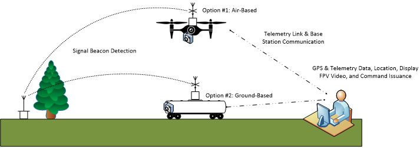

# ABLS – Autonomous Beacon Location System - Watson Capstone Projects Lockheed Martin Corporation

Project Description

	This project will be centered around direction finding of a signaling beacon. This system will be an autonomous 
	vehicle that will be able to locate and navigate to a hidden beacon with minimal operator interaction. The 
	concept of operations will be: a beacon will be hidden from the system and operator. The system will use a 
	directional antenna to locate the beacon and navigate the system to the beacon location. The route of the
	system and location of the beacon will be mapped and tracked with GPS coordinates on a base station for the 
	operator to monitor the location of both the beacon and the system.

Project Requirements

	•	The System and the Operator shall comply with FCC rules and regulations
	•	The System and the Operator shall comply with FAA rules and regulations
	•	Each Operator shall obtain an Amateur Radio License
	•	The System shall be capable of locating an amateur radio signaling beacon from an undefined location
	•	The System shall be a ground-based or air-based vehicle capable of autonomously navigating to the 
		hidden beacon
	•	The System shall map the location and directional path of the ground-based vehicle on the base station 
		using GPS
	•	The System shall have a First-Person View of the ground-based vehicles mission
	•	The System shall display telemetry data on the base station
	•	Telemetry data shall include: distance traveled, distance to the beacon from the rover, direction of the 
		rover (N, S, E, W), speed of the rover, and battery life
	•	The System shall be capable to operate a mission for a minimum of 20 minutes
	•	The System shall be capable of navigating around obstacles
	•	The System shall be durable enough to handle various terrains
	
Con-Op
 

Sponsoring Organization Name and Address

	Sponsoring Organization Name:
		Lockheed Martin Corporation
		
	Sponsoring Organization Address:
		1801 State Route 17C, Owego, NY, 13827
